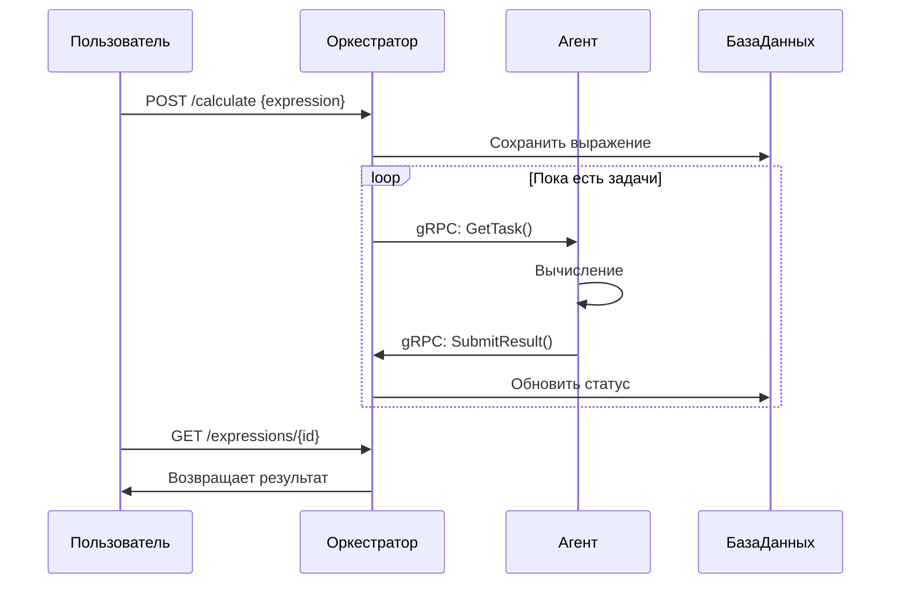

# Распределённый вычислитель арифметических выражений (Calc_2GO)

## Описание проекта
Распределённая система для вычисления арифметических выражений с:
- Многопользовательским режимом (JWT аутентификация)
- Персистентным хранением в SQLite
- gRPC взаимодействием между компонентами
- Автоматическим распределением задач между агентами
- Поддержкой сложных выражений со скобками и приоритетами операций

**Ключевые особенности:**
- Сохранение состояния при перезапуске
- Параллельная обработка задач
- Настраиваемая производительность агентов
- Подробное логирование всех операций

## Структура проекта
* CALC_2GO/
* ├── api/                        # Protobuf и gRPC файлы
* │   ├── calculator_grpc.pb.go
* │   ├── calculator.pb.go
* │   └── calculator.proto
* ├── cmd/
* │   ├── agent/                  # Агент
* │   │   └── main.go             # Точка входа для агента
* │   └── orchestrator/           # Оркестратор
* │       └── main.go             # Точка входа для оркестратора
* ├── internal/
* │   ├── agent/                  # Логика агента
* │   │   ├── agent.go
* │   │   └── agent_test.go
* │   └── orchestrator/           # Логика оркестратора
* │       ├── orchestrator.go
* │       ├── storage.go
* │       └── tests/
* │           ├── integration_test.go
* │           └── module_test.go
* ├── models/                     # Модели данных
* │   └── models.go
* ├── pkg/
* │   └── calculator/             # Логика вычислений
* │       ├── calculator.go
* │       └── calculator_test.go
* ├── .gitignore                  # Игнорируемые файлы
* ├── go.mod                      # Файл модуля Go
* ├── go.sum
* └── README.md


## Запуск проекта

### 1. Убедитесь, что у вас установлена версия Go 1.23 или выше.
Вы можете скачать и установить Go с [официального сайта](https://go.dev/dl/).

**Требования:**
- Go 1.20+
- SQLite3
- gRPC

### 2. Клонируйте репозиторий:
```bash
https://github.com/A6ra-Kada6ra/...
```
### 3. Перейдите в папку проекта:
```bash
  cd <путь_к_проекту>
```
### 4. Установите зависимости:
```bash
  go mod tidy
```

### 5. Запускаем оркестратор:
```bash
go run cmd/orchestrator/main.go
```
### 6. После успешного запуска в консоли высветиться следующее сообщение:
```bash
🛠️ Запуск оркестратора...
🟢 HTTP сервер запущен на :8080
🟢 gRPC сервер запущен на :50051
Database initialized successfully
``` 

### 7.  Откройте новый терминал (не закрывая предыдущий) и запустите агент:
```bash
go run cmd/agent/main.go
```
### 8. После успешного запуска в консоли высветиться следующее сообщение:
```bash
 Агент запущен, подключается к оркестратору по адресу: localhost:50051
🚀 Запуск агента...
```

# Формат запроса
1. Добавление выражения для вычисления
Запрос должен содержать JSON объект со следующей структурой:

## Пример запроса 
1. Регестрация пользователя:
```bash
curl -X POST "http://localhost:8080/api/v1/register" \
-H "Content-Type: application/json" \
-d '{"login":"user1","password":"MySecurePass123"}'
```
## Успешный ответ (200 OK):

``` json
{
  "status":"Пользователь создан"
}
```
Если вы запускает программу во второй раз и уже регестровались, или создали первый акаунт и под теме же данными собираетесь создать новый вы получите ошибку.
## Ошибка (409 Conflict):
``` json
{
   "error":"Пользователь уже существует"
  }
```
2. Аутентификация

## Пример запроса:
```bash
curl -X POST "http://localhost:8080/api/v1/login" \
-H "Content-Type: application/json" \
-d '{"login":"user1","password":"MySecurePass123"}'
```
## Успешный ответ (200 OK):
``` json
{
   "token":"eyJhbGciOiJIUzI1NiIsInR5cCI6IkpXVCJ9..."
  }
```
Если вы что-то ввели неправильно (логин или пароль)то увидите ошибку:
## Ошибка (401 Unauthorized):
``` json
{
   "error":"Неверные учетные данные"
  }
```

3. Добавление выражения

## Пример запроса:
```bash
curl -X POST http://localhost:8080/api/v1/calculate -H "Content-Type: application/json" -H "Authorization: Bearer YOUR_TOKEN" -d "{\"expression\":\"(2+3)*4-10/2\"}"
```
## Успешный ответ (201 Created):
``` json
{
  "id":"1"
}
```
в случае неверного ввода выражения вы получите ошибку.
## Ошибка (422 Unprocessable Entity):
``` json
{
  "error":"Некорректное выражение: неожиданный символ 'a'"
}
```
## Ошибка (400 Bad Request):
``` json
{
  "error":"Неверный формат запроса"
}
```

4. Проверка статуса выражения

## Пример запроса:
```bash
curl http://localhost:8080/api/v1/expressions -H "Authorization: Bearer YOUR_TOKEN"
```
## Ожидаемый ответ:
1. Если программ еще не решила:⬇️
``` json
}
 "id":1,"user_id":1,"expression":"(2+3)*4-10/2","status":"progress","result":
}
``` json
}
 "id":1,"user_id":1,"expression":"(2+3)*4-10/2","status":"done","result":15
}
```
2. При успешном решении: ⬆️
## Ошибка (404 Not Found):
```bash
"error":"Выражение не найдено"
```

## Ограничения и требования к запросу

Калькулятор имеет следующие ограничения и требования к арифметическим выражениям, которые он может обрабатывать:

Поддерживаемые операции:
- Сложение (`+`)
- Вычитание (`-`)
- Умножение (`*`)
- Деление (`/`)

Особенности обработки:
- Калькулятор поддерживает использование скобок для задания порядка операций.
- Допускаются пробелы между операциями и числами.
- Числа могут быть целыми.

Ограничения:
- Запрос с пустым выражением приведет к ошибке 422 (некорректное выражение).
- Деление на ноль вызовет ошибку 422.
- Калькулятор не может обрабатывать:
  - Нечисловые символы (например, буквы или специальные символы, отличные от разрешенных операций и скобок).
  - Неверное использование скобок (например, если скобки не сбалансированы).
  - Строки, содержащие более одного оператора подряд без операндов (например, `2++2`).

  * Ограничения выражений
Параметр	                  Значение	                    Пример ошибки
Максимальная длина	      100 символов	          "Слишком длинное выражение"
Вложенность скобок	      10 уровней	           "Слишком глубокая вложенность"
Поддерживаемые операции	  +, -, *, /	             "Неподдерживаемая операция ^"
Формат чисел	           Целые и дробные	          "Неверный формат числа: 2."


Коды ошибок
400 Bad Request - Неверный формат запроса

401 Unauthorized - Требуется аутентификация

404 Not Found - Ресурс не найден

422 Unprocessable Entity - Ошибка в выражении

500 Internal Server Error - Ошибка сервера


### Настройка времени выполнения операций
Время выполнения операций задается переменными среды в миллисекундах:

* TIME_ADDITION_MS — время выполнения операции сложения.

* TIME_SUBTRACTION_MS — время выполнения операции вычитания.

* TIME_MULTIPLICATION_MS — время выполнения операции умножения.

* TIME_DIVISION_MS — время выполнения операции деления.

## Пример настройки:

```bash
export TIME_ADDITION_MS=1000
export TIME_SUBTRACTION_MS=1000
export TIME_MULTIPLICATION_MS=1000
export TIME_DIVISION_MS=1000
```
Настройка вычислительной мощности агента
Количество горутин (вычислительных мощностей) агента регулируется переменной среды COMPUTING_POWER.

**Пример настройки:** 

```bash
export COMPUTING_POWER=2
```
Тестирование
Для запуска тестов выполните:

```bash
go test ./...
```
Интеграционные тесты
```bash
cd internal/orchestrator/tests
go test -v -run TestIntegration
```
### диаграмма:


